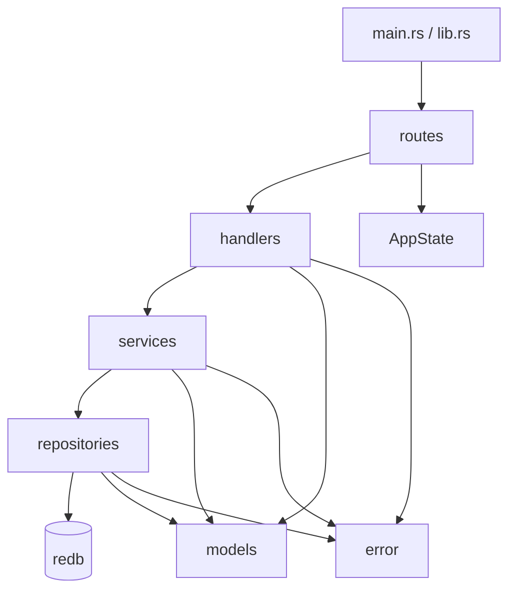

# Kasane Architecture

このドキュメントは、Kasane のレイヤー構造、依存の方向、各レイヤーの責務をまとめたものです。

## 基本方針

Kasane は「外側のレイヤーが内側のレイヤーを利用する」構造を取ります。依存の方向は常に内向きです。

## レイヤーの責務

### `main.rs` / `lib.rs`

- アプリケーション全体の起点。
- `AppState` を組み立ててルーターに渡す。
- ルーティングの組み立て以外の業務ロジックは持たない。

### `routes`

- HTTP エンドポイントと handler の紐付けを行う。
- ここではリクエストの解釈や永続化はしない。
- ルート設計は REST のリソース構造に寄せる。

### `handlers`

- HTTP の入出力を扱う。
- Path / Query / Json を受け取り、サービス層に渡す。
- レスポンスの HTTP ステータスや JSON 形式を決める。
- ドメインロジックや DB 操作は持たない。

### `services`

- アプリケーションの処理手順を組み立てる。
- バリデーション、存在確認、作成、削除などのユースケースを表現する。
- トランザクションの開始と commit の責務を持つ。
- repository を呼び出して具体的な保存処理を行う。

### `repositories`

- `redb` へのアクセスを隠蔽する。
- テーブルの open / get / insert / remove などの低レベル操作を担当する。
- 低レベル操作を提供するため、その整合性を保つ責務はservices層にある
- 業務ルールは持たない。
- `redb` の型や詳細を上位層へ漏らしすぎない。

### `models`

- request / response / domain / entity の型定義を置く。
- できるだけ純粋なデータ構造に保つ。
- 上位層から使われる共有型であり、サービスや repository の実装詳細には依存しない。

### `error`

- アプリケーション全体で共通に扱うエラーを定義する。
- HTTP への変換責務もここで持つ。
- 各層は `AppError` に寄せてエラーを返す。

### `db_init`

- `redb` の初期化と内部テーブル定義を担当する。
- 実行時の基盤構築に限定し、業務ロジックは持たない。

## 依存ルール

### 許可される依存

- `routes` -> `handlers`
- `handlers` -> `services`, `models`, `error`
- `services` -> `repositories`, `models`, `error`, `helpers`
- `repositories` -> `db_init`, `models`, `error`, `redb`
- `main.rs` / `lib.rs` -> `routes`, `db_init`, `AppState`

### 禁止したい依存

- `repositories` から `services` や `handlers` を呼ぶこと
- `models` から上位レイヤーへ依存すること
- `handlers` に DB 操作を直接書くこと
- `routes` に業務ロジックを置くこと

## Table API の流れ

`/tables` 系 API は次の順序で処理されます。

1. `routes` が HTTP メソッドとパスを handler に割り当てる。
2. `handlers` が request を取り出して service を呼ぶ。
3. `services` がバリデーションとトランザクション管理を行う。
4. `repositories` が `redb` を使って実データを読み書きする。
5. `error` が失敗を HTTP レスポンスに変換する。

## 補足

- `create` は `POST /tables`。
- `info` は `GET /tables/{name}`。
- `remove` は `DELETE /tables/{name}`。
- 追加の CRUD が増えても、この依存方向は変えない。