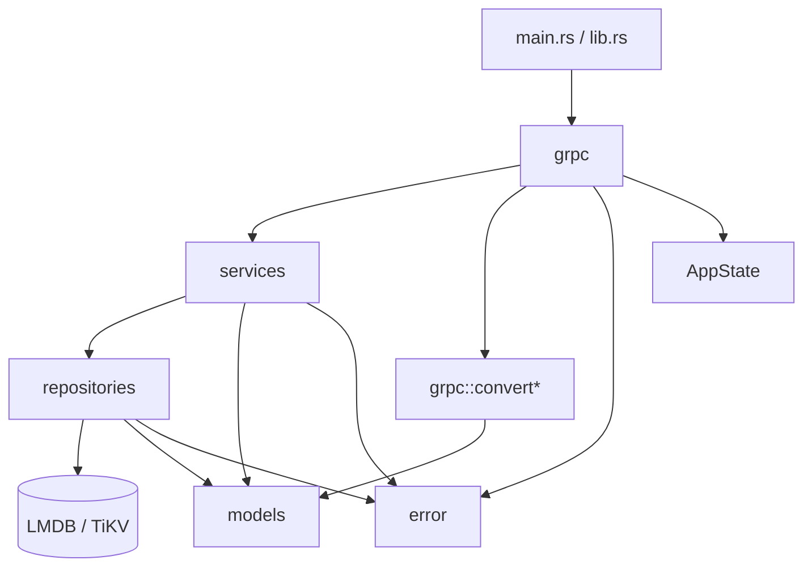

# Kasane Architecture

このドキュメントは、Kasane のレイヤー構造、依存の方向、各レイヤーの責務をまとめたものです。

## 基本方針

Kasane は「外側のレイヤーが内側のレイヤーを利用する」構造を取ります。依存の方向は常に内向きです。

## レイヤーの責務

### `main.rs` / `lib.rs`

- アプリケーション全体の起点。
- `AppState` を組み立てて gRPC サーバーに渡す。
- サーバーの起動以外の業務ロジックは持たない。

### `grpc`

- proto（`proto/*.proto`）から生成された gRPC サービス・メッセージ型（`grpc::pb`）と、各サービスの実装（`grpc::database`, `grpc::table` 等）を置く。
- `grpc::convert*` が proto のメッセージ型とドメイン型（`models`）の相互変換を担う。
- 認証は `grpc::auth`（JWT の検証、利用者レコードの読み直しと `AuthUser` の組み立て、Login RPC）が集約して担う。
- ドメインロジックや DB 操作は持たない。

### `services`

- アプリケーションの処理手順を組み立てる。
- バリデーション、存在確認、作成、削除などのユースケースを表現する。
- トランザクションの開始と commit の責務を持つ。
- repository を呼び出して具体的な保存処理を行う。

### `repositories`

- ストレージバックエンド（LMDB / TiKV）へのアクセスを隠蔽する。
- テーブルの open / get / insert / remove などの低レベル操作を担当する。
- 業務ルールは持たない。
- バックエンド固有の型や詳細を上位層に公開しない。
- データの整合性確保は services 層の責務である。

### `models`

- request / response / domain / entity の型定義を置く。
- 純粋なデータ構造を定義する。
- サービスや repository の実装詳細に依存しない。

### `error`

- アプリケーション全体で共通に扱うエラー（`AppError`, `AuthError`）を定義する。
- gRPC の `tonic::Status` および `google.rpc.ErrorInfo`（機械可読コード）への変換責務もここで持つ。
- 各層は `AppError` に寄せてエラーを返す。

### `backend`

- LMDB（`heed`）または TiKV の接続初期化と基盤構築を担当する。
- 業務ロジックは持たない。

## 依存ルール

### 許可される依存

- `grpc` -> `services`, `models`, `error`
- `services` -> `repositories`, `models`, `error`, `helpers`
- `repositories` -> `models`, `error`, ストレージエンジン
- `main.rs` / `lib.rs` -> `grpc`, `backend`, `AppState`

### 禁止したい依存

- `repositories` から `services` や `grpc` を呼ぶこと
- `models` から上位レイヤーへ依存すること
- `grpc` に DB 操作を直接書くこと

## Table サービスの流れ

`TableService` 系の RPC は次の順序で処理されます。

1. `grpc::auth` が JWT を検証し、最新の利用者レコードから `AuthUser` を構築する。
2. `grpc::table` が proto のメッセージをドメイン型へ変換し、service を呼ぶ。
3. `services` がバリデーションとトランザクション管理を行う。
4. `repositories` がストレージエンジン（LMDB または TiKV）を使って実データを読み書きする。
5. `error` が失敗を `tonic::Status` に変換する。

## 補足

- `create` は `TableService.Create`。
- `get` は `TableService.Get`。
- `delete` は `TableService.Delete`。
- 追加の CRUD が増えても、この依存方向は変えない。